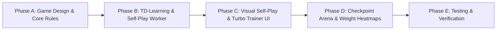

# Chessesque: Handover — Custom Chess-Esque Game & Self-Training Engine

> **Notice for Incoming LLM / Developer**:
> This document is a comprehensive architectural handover and roadmap for **Chessesque**.
> - **Phase 1 (Standard Chess Rule Engine & Luxury Studio)** and **Phase 2 (Classical Search, Web Workers, Multi-PV, SharedArrayBuffer TT, Modern Pruning)** are **100% complete, verified, and passing all tests**.
> - The user's new objective is to extend Chessesque with:
>   1. A **novel, custom chess-esque 2-player game** (custom board/pieces/rules with custom FEN/PGN equivalent).
>   2. A **trainable self-play engine** using Reinforcement Learning (TD-Learning / TD-Leaf) that trains from scratch (**tabula rasa / 0-experience**).
>   3. A **luxury dual-mode training studio**: real-time move-by-move visual observation (with delay slider) + turbo background self-play (hundreds/thousands of games).
>   4. A **checkpoint system** (`Gen 0`, `Gen 50`, `Gen 200`, `Gen 1000`) and **Checkpoint Arena** (head-to-head matchups between different generations).
>   5. Live **interpretability UI**: visual piece valuation charts and positional heatmaps evolving in real time.

---

## 1. Project Background & Current State

### A. What is Already Built and Tested
The repository currently contains a complete, production-grade bitboard chess platform:
* **Core Rule Engine (`src/core/`)**:
  * 64-bit BigInt bitboard representations, precomputed attack tables (rays, knights, kings, pawns).
  * 64-bit Zobrist hashing for $O(1)$ state hashing and threefold repetition detection.
  * 100% verified legal move generator (Perft tested against Stockfish reference values).
  * Custom FEN parser/serializer, SAN move generator, and PGN export.
* **Classical Search & AI Engine (`src/engine/`)**:
  * Negamax Alpha-Beta search with Quiescence, MVV-LVA move ordering, Killer & History heuristics.
  * Modern pruning: Null Move Pruning (NMP) and Late Move Reductions (LMR).
  * Multi-PV candidate lines (1 to 5 lines simultaneously).
  * Lockless 64-bit atomic `SharedTranspositionTable` with `SharedArrayBuffer` and Lazy SMP multi-threading across Web Workers.
* **Interactive Luxury Studio (`src/ui/`)**:
  * Obsidian dark glassmorphism theme, SVG vector pieces, dynamic gradient arrows.
  * Real-time centipawn Eval Bar, live telemetry (NPS, depth, nodes, time).
  * Click-to-apply candidate moves, time-travel move history, procedural audio synthesizer.

All unit tests pass with 100% accuracy (`npm test`), 0 linter errors (`npm run lint`), and clean TypeScript build (`npm run build`).

---

## 2. Core Technical Findings & Clarifications

### A. Why Lichess Reaches Depth 25+ While Our Engine Reaches Depth 13
* **Branching Factor ($b$)**: Standard chess has an average branching factor of $\sim 35$. Alpha-Beta reduces this to $\sim 6$. Our engine's effective branching factor is $b \approx 3.4$ ($3.4^{13} \approx 22\text{M nodes}$ in 33 seconds).
* **Stockfish on Lichess** operates at $b \approx 1.6\text{--}1.8$ ($1.7^{25} \approx 50\text{M nodes}$ in 5–8 seconds). It achieves this via:
  1. C++ compiled to WebAssembly with 128-bit SIMD vector instructions (achieving 3M–10M+ NPS).
  2. 20+ aggressive pruning heuristics (ProbCut, Singular Extensions, SEE pruning, Futility Pruning, History Reductions).
  3. Highly accurate NNUE positional evaluation that yields razor-sharp alpha-beta cutoffs.

### B. NNUE vs. AlphaZero vs. In-Browser Self-Training
* **NNUE Misconception**: NNUE does *not* require human games; Stockfish trains NNUE on billions of self-play positions. However, backpropagation over hundreds of millions of positions requires days on dedicated GPU clusters (PyTorch/CUDA) and cannot be trained interactively inside a browser tab.
* **AlphaZero (Deep ResNet + MCTS)**: Evaluating a 20-block convolutional ResNet inside the browser takes $\sim 20\text{ms}$ per inference. At 800 rollouts per move, a single move takes 16 seconds, making self-play games painfully slow.
* **The Winning Solution: TD-Learning (Temporal Difference Learning)**:
  * Uses **Temporal Difference RL (TD-Leaf / TD-$\lambda$)** on generalized piece values, piece-square tables, and positional heuristics.
  * **Tabula Rasa**: Starts with all weights at 0.0. The engine has zero chess knowledge—it only learns from terminal game outcomes (Win $= +1$, Loss $= -1$, Draw $= 0$).
  * **Blazing Fast**: A 40-move game runs in **5 to 15 milliseconds**! The engine can self-play **100 games in ~1 second** or **1,000 games in 10–15 seconds** in a background Web Worker.
  * **100% Visually Interpretable**: As it trains, you can watch piece values evolve (e.g. piece $X$ value climbing from $0.0 \to 3.2 \to 8.5$) and board squares light up in a tactical heatmap.

---

## 3. Mission Objectives for the Incoming Agent

### Objective 1: Custom Chess-Esque Game Framework
Design and implement a new, playable 2-player board game within the studio:
1. **Game Concept & Rules**:
   * Brainstorm and finalize with the user (e.g. **"Empress Chess"** on $8 \times 8$, **"Grand Mini-Chess"** on $6 \times 6$, or a custom variant with fairy pieces).
   * Popular candidate pieces:
     * **The Empress (Chancellor)**: Rook + Knight compound piece.
     * **The Princess (Archbishop)**: Bishop + Knight compound piece.
     * **Custom Pawns / Royal Guard / Assassin**: Unique movement, capture vectors, or promotion mechanics.
   * Win conditions: Royal capture/checkmate, citadel invasion, or material elimination.
2. **Game Abstraction Layer**:
   * Decouple the engine with a clean `GameState<TMove>` interface:
     ```typescript
     export interface GameState<TMove> {
       activePlayer: number; // 0 (White/P1) or 1 (Black/P2)
       generateLegalMoves(): TMove[];
       makeMove(move: TMove): void;
       unmakeMove(move: TMove): void;
       isTerminal(): { isOver: boolean; winner?: number | 'draw' };
       getZobristKey(): bigint;
       toFEN(): string;
       loadFEN(fen: string): boolean;
       formatMoveSAN(move: TMove): string;
     }
     ```
   * Fast bitboard or typed-array grid representation reusing Zobrist keys and move generators.
3. **Custom Notation & Serialization**:
   * Custom FEN string format (e.g. `e` for Empress, `a` for Princess).
   * SAN notation and PGN export for custom game replays.

---

### Objective 2: Trainable Self-Play Engine (TD-Learning)
1. **Weight Model Architecture (`EvaluationWeights`)**:
   ```typescript
   export interface EvaluationWeights {
     pieceValues: Record<string, number>; // Material weight per piece type
     pieceSquareTables: Record<string, number[]>; // Positional bonus per square
     tempoBonus: number;
     mobilityWeight: number;
   }
   ```
2. **TD-Leaf($\lambda$) / Reinforcement Learning Loop**:
   * Start with **Zero Knowledge (Tabula Rasa)**: all piece values = 0, all square values = 0.
   * Self-play moves selected via shallow search (Depth 2–4 with $\epsilon$-greedy exploration or softmax temperature).
   * After each game, TD error propagates backward:
     $$\delta_t = V(s_{t+1}) - V(s_t)$$
     $$\Delta w = \alpha \sum_{t} \delta_t \nabla_w V(s_t)$$
   * Terminal rewards: $+1000$ for winning, $-1000$ for losing, $0$ for draw.
   * Watch material weights naturally discover that strong pieces are valuable, and central squares provide tactical superiority.

---

### Objective 3: Luxury Dual-Mode Training & Arena Studio

1. **Visual Live Mode ("The Microscope")**:
   * Real-time self-play playback directly on the interactive board.
   * **Move Delay Slider**: 50ms, 200ms, 500ms, 1000ms, 2000ms per move.
   * Shows live candidate arrows, thinking line, and eval bar updates after every move.
   * Interactive controls: Play, Pause, Step Forward, Step Backward.
2. **Turbo Background Training Mode**:
   * Run headless self-play inside a Web Worker.
   * Quick action buttons: **"Train 50 Games"**, **"Train 200 Games"**, **"Train 1,000 Games"**.
   * Non-blocking 60fps UI with live progress bar, games/second telemetry, and loss curve.
3. **Checkpoint Manager**:
   * Snapshots stored at generations: `Gen 0 (Random/Untrained)`, `Gen 50`, `Gen 200`, `Gen 500`, `Gen 1000`.
   * Stored in `localStorage` with JSON export/import support.
4. **Checkpoint Arena (Head-to-Head Exhibition)**:
   * Matchmaker interface: Select **P1 (e.g. Gen 0)** vs. **P2 (e.g. Gen 500)**.
   * Options:
     * **Watch 1 Live Game**: Observe the tactical difference move-by-move.
     * **Simulate 20 Games**: Run a quick tournament in the worker to output Win / Loss / Draw stats and estimated Elo difference.
5. **Interpretability Dashboard**:
   * **Live Piece Value Evolution Chart**: Real-time line chart showing how the AI discovered each piece's worth.
   * **Interactive Positional Heatmap**: Click any piece to see which board squares the AI learned to favor or avoid.

---

## 4. Suggested Implementation Phasing



* **Phase A (Game Design & Core Engine)**:
  * Finalize the custom game rules, board dimensions, and piece move vectors.
  * Implement the custom game class implementing `GameState<TMove>`.
  * Add custom FEN, SAN, and PGN serializers.
  * Add automated rule & move-generation unit tests.
* **Phase B (TD-Learning Engine & Worker)**:
  * Implement `EvaluationWeights`, `evaluateCustom()`, and `tdUpdate()`.
  * Create `selfPlayWorker.ts` supporting both single-step visual emission and turbo batch training.
* **Phase C (Visual Self-Play & Turbo UI)**:
  * Add game selector to switch between Standard Chess and Custom Game.
  * Build the Live Self-Play viewer with speed slider (50ms–2000ms), play/pause, and step buttons.
  * Build the Turbo Trainer card with progress bar, games/sec, and win rate.
* **Phase D (Checkpoint Manager & Arena)**:
  * Implement snapshot saving, listing, and loading.
  * Build the Head-to-Head Arena modal/tab (Gen X vs Gen Y) with live exhibition and batch tournament modes.
  * Build the Piece Valuation chart and board positional heatmap visualizer.
* **Phase E (Verification & Polish)**:
  * Verify all tests (`npm test`), lint (`npm run lint`), and build (`npm run build`).
  * Verify full responsive layout and audio synthesizer integration for custom piece moves.

---

## 5. Ready-to-Paste Prompt for the New Chat

Copy and paste the prompt below into the new chat to begin immediately:

```text
Hi! I'm continuing the development of Chessesque, a high-performance bitboard chess and trainable game engine studio.
Phase 1 (Complete 8x8 Chess rules & luxury studio) and Phase 2 (Classical Search, Web Workers, Multi-PV, SharedArrayBuffer TT, Modern Pruning) are 100% complete and verified.

Please review `HANDOVER_CUSTOM_GAME_TRAINING.md` in the repository for full technical context.

I want to collaborate on:
1. Brainstorming and designing a compelling custom chess-esque 2-player board game (novel pieces, custom rules, and FEN/PGN equivalent).
2. Implementing the core rule engine and move generator for this game.
3. Implementing a trainable self-play engine using Reinforcement Learning (TD-Learning / TD-Leaf) that starts tabula rasa (0 knowledge) and learns by playing games against itself.
4. Building a dual-mode Training Studio in the UI:
   - Visual Live Mode: watch self-play games move-by-move in real time with a speed slider (50ms - 2s).
   - Turbo Background Mode: train 50, 200, 1000 games in seconds via Web Worker.
   - Checkpoint System: save checkpoints (Gen 0, 50, 200, 1000) and pit different generations against each other in a Head-to-Head Checkpoint Arena.
   - Interpretability: live charts showing how the AI discovers piece values and square heatmaps.

Let's start by discussing ideas for the custom game design and then planning the technical implementation.
```
